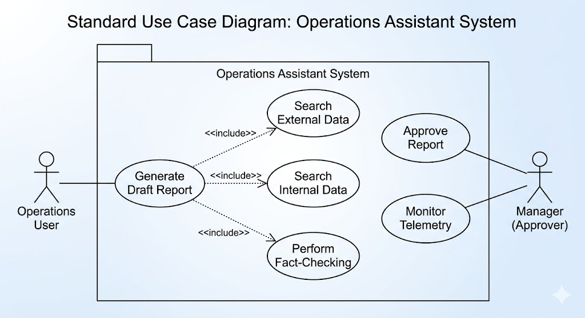
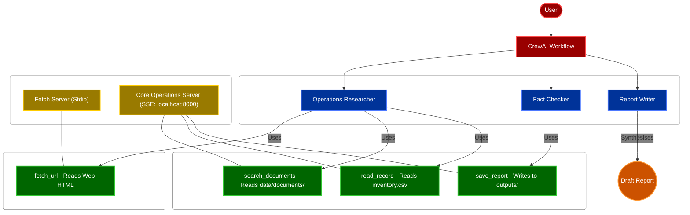
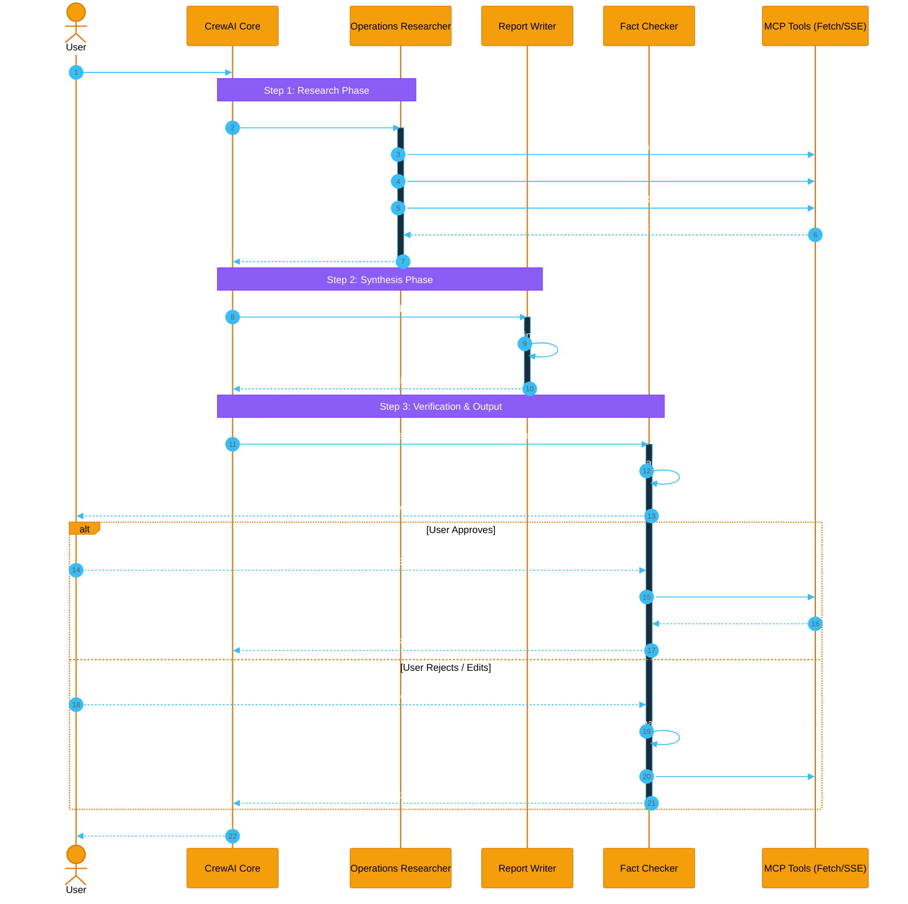
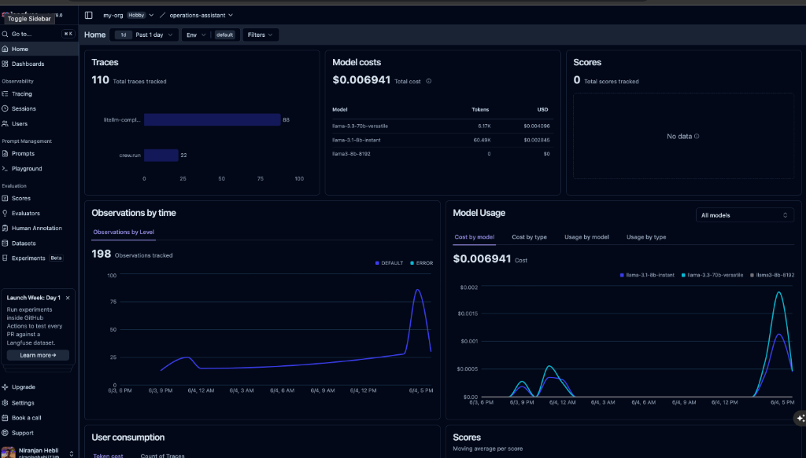
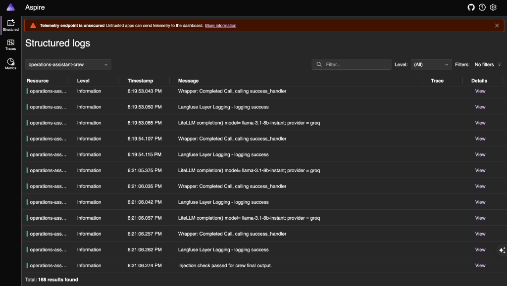

# Operations Assistant

[](https://www.python.org)
[](https://github.com/astral-sh/uv)
[](https://github.com/crewAIInc/crewAI)
[](https://modelcontextprotocol.io)
[](https://github.com/jlowin/fastmcp)
[](https://groq.com)
[](https://opentelemetry.io)
[](https://langfuse.com)
[](https://github.com/BerriAI/litellm)

## What It Does
This is a multi-agent AI system (CrewAI) integrated with multiple Model Context Protocol (MCP) servers. The Assistant helps operations teams answer business questions automatically by querying local text documents, inventory data, and fetching external web resources.

## Demo & Pitch Videos

### Pitch Presentation (Idea, Pain Points & Solution)
This video walks through the business pain points of manual operations research, the core concept behind the Operations Assistant, our multi-agent solution, and target use cases.

[](https://www.loom.com/share/36be91ddba8e41c184f246e3d31eb264)

### Live System Demo (Technical Walkthrough)
This video demonstrates the working system end-to-end, showing the multi-agent execution, tools usage via MCP, human-in-the-loop validation, and generated outputs.

[](https://www.loom.com/share/e008d887287b4cb5a7595cfb49b5570f)

## Use Cases
The Operations Assistant is designed to address key operational challenges across various business workflows:
- **Internal Knowledge Retrieval & Support**: Automatically querying local standard operating procedures (SOPs), return policies, compliance documents, and support tickets in `data/documents/` to instantly answer team queries.
- **Inventory Check & Verification**: Reading and analyzing structured data records (e.g., querying product lines in `data/inventory.csv` using the `read_record` tool) to verify stock levels, product specifications, and pricing.
- **Outbound Web Research & Market Intelligence**: Utilizing the Stdio Fetch Server to parse external HTML pages, allowing operations teams to pull current competitor pricing, shipping options, or external vendor terms.
- **Fact-Checked Operations Reports**: Generating structured reports (saved to the `outputs/` folder) with automated fact-checking and Human-in-the-Loop approval to prevent hallucinations in operational decisions.

### Use Case Diagram


## Quick Start

### Automated Setup
The easiest way to initialize the project is by running the `setup.sh` shell script:
```bash
./setup.sh
```
This script automates the environment setup by performing the following tasks:
- **Verifies python environment**: Checks if `pip` is installed on your machine.
- **Installs package manager**: Installs the `uv` dependency manager (`pip install uv`) if not already present.
- **Installs dependencies**: Runs `uv sync` to set up a virtual environment and install all project dependencies.
- **Configures environment variables**: Safely checks if a `.env` file exists; if not, it copies `.env.example` to `.env` (or creates a blank one).

After running, open the newly created `.env` file and add your `GROQ_API_KEY`.

### Manual Setup
1. Clone the repository

2. Install uv: `pip install uv`

3. Install dependencies: `uv sync`

4. Set up your environment variables:
   ```bash
   cp .env.example .env
   ```
   Open `.env` and add your `GROQ_API_KEY`. (Optionally, also add your Langfuse keys to enable cloud tracing).

5. **Start the Core MCP server** (SSE mode) in a dedicated terminal:
   ```bash
   uv run python server/mcp_server.py
   ```
   You should see Uvicorn start up on `http://0.0.0.0:8000`. Keep this terminal open.

6. In a **second terminal**, ask the Assistant a question:
   ```bash
     uv run python -m crew.crew "What is the return policy?"
   ```

7. View generated traces in the `traces/` folder and generated reports in the `outputs/` folder.

## Architecture & MCP Servers



The project runs **two separate MCP servers** using different transports:
1. **Core Operations Server (`server/mcp_server.py`)** — runs over **SSE (Server-Sent Events)** on `http://localhost:8000/sse`:
   - `search_documents`: Search local text documentation.
   - `read_record`: Query product inventory records.
   - `save_report`: Save structured Markdown reports to the `outputs/` folder.
2. **Fetch Server (`server/mcp_fetch_server.py`)** — runs over **Stdio** (spawned inline by the crew):
   - `fetch_url`: Retrieve and parse HTML content from external URLs (e.g. for operations research).

Agents in the crew are specialized:
- **Operations Researcher**: Equipped with the `fetch_url` tool to gather external web context, plus `search_documents` and `read_record` for internal details.
- **Report Writer**: Synthesises the Researcher's findings into a clean, structured Markdown report.
- **Fact Checker**: Cross-references the draft report against retrieved evidence, corrects unsupported claims, and gates saving behind human approval (HITL).

### Agent Workflow Sequence



## Sample Data
The repository includes a set of sample data used by the MCP servers to answer operations questions:
- `data/documents/`: A folder containing small text files (e.g., policies, tickets). The `search_documents` tool searches through these files.
- `data/inventory.csv`: A CSV file containing mock product inventory records. The `read_record` tool queries specific records from this file by their ID.

## Test the MCP Servers Alone
You can inspect and test the MCP tools visually using the MCP Inspector.

**Operations Server (SSE mode):**
Start the server first, then connect the inspector to it:
```bash
# Terminal 1 — start SSE server
uv run python server/mcp_server.py

# Terminal 2 — connect inspector
npx @modelcontextprotocol/inspector --transport sse --server-url http://127.0.0.1:8000/sse
```

**Fetch Server (Stdio mode):**
```bash
npx @modelcontextprotocol/inspector uv run python server/mcp_fetch_server.py
```

## Run Tests
Run the automated test suite:
```bash
uv run pytest tests/ -v
```

## Observability & Custom Tracing
This project integrates OpenTelemetry to monitor agent workflows and track LLM calls, latency, and token usage, utilizing both local Aspire Dashboard and cloud Langfuse tracking.

### Langfuse Tracing Dashboard


### Aspire Structured Logs


1. **Start the Aspire Dashboard:**
   Make sure you have Docker installed and running, then spin up the dashboard container:
   ```bash
   docker compose up -d
   ```
2. **Open the Dashboard UI:**
   Navigate to [http://localhost:18888](http://localhost:18888) to access the dashboard.
3. **Capture Traces:**
   Run the assistant workflow normally:
   ```bash
     uv run python -m crew.crew "What is the return policy?"
   ```
   Traces will automatically export to the dashboard's OTLP endpoint (`http://localhost:4317`) for visual inspection under the **Traces** tab. They will also be sent to Langfuse if configured in your `.env`.

## Future Scope
The following features are planned for future releases to enhance scalability, usability, and integration:
- **Interactive User Dashboard**: Building a sleek web UI (using React/Vite) to move away from terminal commands, allowing operations teams to interact with agents, edit drafts, and view logs dynamically.
- **Enterprise Chat Integration**: Packaging the assistant as a Slack or Microsoft Teams bot to enable team-wide collaboration directly from existing chat channels.
- **Production Database Connections**: Migrating MCP server data tools to query production relational databases (PostgreSQL, MySQL) and enterprise ERP systems (SAP, Salesforce).
- **Multi-Modal Document Parsing**: Upgrading reasoning agents to handle invoices, charts, and scanned PDFs using multi-modal LLMs.

## Project Documentation
Additional design documentation and reflections are available in the [docs/](./docs/) folder:

- [Business Case Study](./docs/business_case_study.md): Details the losses teams previously faced, how the Operations Assistant mitigates them, and calculations projecting annual savings in Lakh rupees.
- [Decision Log](./docs/decision_log.md): Outlines architectural decisions, framework selections, and alternatives considered or rejected.
- [Reflection](./docs/reflection.md): Post-build reflection covering agent roles, connection debugging, security mitigations, and production readiness guidelines.
- [AI Usage Log](./docs/ai_usage_log.md): Documentation of AI interactions applied during development.
- [Data & Examples](./docs/data_and_examples.md): Sample data and example questions with saved outputs.
