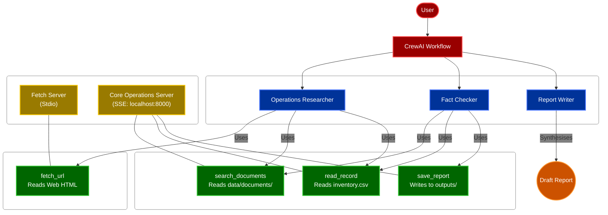

# Operations Assistant

[](https://www.python.org)
[](https://github.com/astral-sh/uv)
[](https://github.com/crewAIInc/crewAI)
[](https://modelcontextprotocol.io)
[](https://github.com/jlowin/fastmcp)
[](https://groq.com)
[](https://opentelemetry.io)
[](https://langfuse.com)
[](https://github.com/BerriAI/litellm)

## What It Does
This is a multi-agent AI system (CrewAI) integrated with multiple Model Context Protocol (MCP) servers. The Assistant helps operations teams answer business questions automatically by querying local text documents, inventory data, and fetching external web resources.

## Architecture & MCP Servers



The project runs **two separate MCP servers** using different transports:
1. **Core Operations Server (`server/mcp_server.py`)** — runs over **SSE (Server-Sent Events)** on `http://localhost:8000/sse`:
   - `search_documents`: Search local text documentation.
   - `read_record`: Query product inventory records.
   - `save_report`: Save structured Markdown reports to the `outputs/` folder.
2. **Fetch Server (`server/mcp_fetch_server.py`)** — runs over **Stdio** (spawned inline by the crew):
   - `fetch_url`: Retrieve and parse HTML content from external URLs (e.g. for operations research).

Agents in the crew are specialized:
- **Operations Researcher**: Equipped with the `fetch_url` tool to gather external web context, plus `search_documents` and `read_record` for internal details.
- **Report Writer**: Synthesises the Researcher's findings into a clean, structured Markdown report.
- **Fact Checker**: Cross-references the draft report against retrieved evidence, corrects unsupported claims, and gates saving behind human approval (HITL).

## Sample Data
The repository includes a set of sample data used by the MCP servers to answer operations questions:
- `data/documents/`: A folder containing small text files (e.g., policies, tickets). The `search_documents` tool searches through these files.
- `data/inventory.csv`: A CSV file containing mock product inventory records. The `read_record` tool queries specific records from this file by their ID.

## Quick Start
1. Clone the repository

2. Install uv: `pip install uv`

3. Install dependencies: `uv sync`

4. Set up your environment variables:
   ```bash
   cp .env.example .env
   ```
   Open `.env` and add your `GROQ_API_KEY`. (Optionally, also add your Langfuse keys to enable cloud tracing).

5. **Start the Core MCP server** (SSE mode) in a dedicated terminal:
   ```bash
   uv run python server/mcp_server.py
   ```
   You should see Uvicorn start up on `http://0.0.0.0:8000`. Keep this terminal open.

6. In a **second terminal**, ask the Assistant a question:
   ```bash
     uv run python -m crew.crew "What is the return policy?"
   ```

7. View generated traces in the `traces/` folder and generated reports in the `outputs/` folder.

## Test the MCP Servers Alone
You can inspect and test the MCP tools visually using the MCP Inspector.

**Operations Server (SSE mode):**
Start the server first, then connect the inspector to it:
```bash
# Terminal 1 — start SSE server
uv run python server/mcp_server.py

# Terminal 2 — connect inspector
npx @modelcontextprotocol/inspector --cli http://localhost:8000/sse --transport sse
```

**Fetch Server (Stdio mode):**
```bash
npx @modelcontextprotocol/inspector uv run python server/mcp_fetch_server.py
```

## Run Tests
Run the automated test suite:
```bash
uv run pytest tests/ -v
```

## Observability & Custom Tracing
This project integrates OpenTelemetry to monitor agent workflows and track LLM calls, latency, and token usage, utilizing both local Aspire Dashboard and cloud Langfuse tracking.

1. **Start the Aspire Dashboard:**
   Make sure you have Docker installed and running, then spin up the dashboard container:
   ```bash
   docker compose up -d
   ```
2. **Open the Dashboard UI:**
   Navigate to [http://localhost:18888](http://localhost:18888) to access the dashboard.
3. **Capture Traces:**
   Run the assistant workflow normally:
   ```bash
     uv run python -m crew.crew "What is the return policy?"
   ```
   Traces will automatically export to the dashboard's OTLP endpoint (`http://localhost:4317`) for visual inspection under the **Traces** tab. They will also be sent to Langfuse if configured in your `.env`.

## Project Documentation
Additional design documentation and reflections are available in the [docs/](./docs/) folder:
- [Decision Log](./docs/decision_log.md): Outlines architectural decisions, framework selections, and alternatives considered or rejected.
- [Reflection](./docs/reflection.md): Post-build reflection covering agent roles, connection debugging, security mitigations, and production readiness guidelines.
- [AI Usage Log](./docs/ai_usage_log.md): Documentation of AI interactions applied during development.
